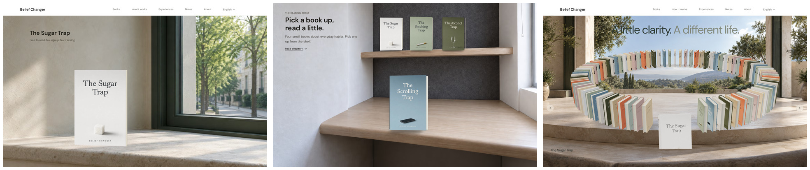
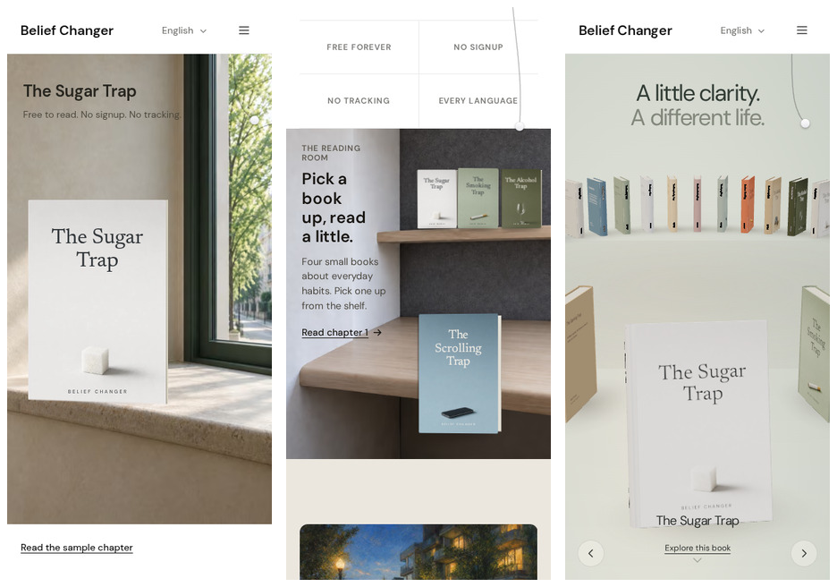
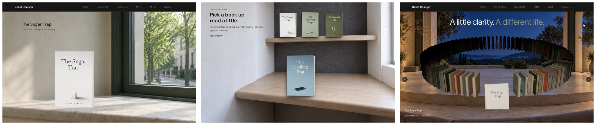

# Belief Changer website — three-track final status

Date: 2026-09-19

All three experiment branches reached their branch-level DONE gates, were committed, and were pushed independently. Nothing was merged to `main` and nothing was deployed. The protected working tree `/home/kab/Belief-Changer-Website` remained clean on `main` during finalization.

| Track | Final branch | Final commit | Verdict |
| --- | --- | --- | --- |
| A — Cinematic Life Outside | `experiment/cinematic-lived-world` | `227b570a35e6da6e8c1425e2c05c779325e9fd73` | PASS — promote R14 cinematic still |
| B — Living Reading Room | `experiment/living-editorial-atlas` | `3d378ef12dbe2c5e82e6232f7717ec7fdadea233` | PASS — bank R13; R14 image direction killed |
| C — Cinematic Orbit | `experiment/orbit-cinematic-world` | `cd1cad5816e1c0fce1ade7dc4e8cf864c45142be` | PROMOTE — R2 authored Orbit world |

## Final comparison

Desktop, left-to-right A / B / C:

Mobile, left-to-right A / B / C:

Dark/night, left-to-right A / B / C:

## Track A — final read

R14 replaces the generic homepage hero with one authored daylight architectural scene around the immutable Sugar Trap cover. The book is seated on the limestone sill with a measured plate-derived nosing overlap; live DOM copy stays in the calm plaster field; mobile has its own portrait composition. Final critique: it is the calmest and most homepage-ready A direction, although R13 retains slightly stronger local nesting. No motion was reintroduced to compensate for that trade.

Validation preserved on the branch: full unit suite 66/66, typecheck clean, production build clean; desktop/mobile/dark/RTL/reduced-motion and 200% reflow captured; cover pixels remain unfiltered/unrepainted; CLS approximately zero. Result note: `R14-RESULT.md` on the Track A branch.

## Track B — final read

The generated R14 room direction was explicitly killed by the visual gate because it read as furniture/showroom staging and weakened the shelf/table relationship. The final branch therefore banks R13: the useful shelf-to-desk title transfer plus the stronger material-continuity room, now mounted on the real homepage. Final critique: the nook reads as a believable reading place, not a PDP/card system; mobile remains a physical room; RTL keeps the camera unmirrored. One Arabic title-spacing bug was repaired during final QA.

Validation preserved on the branch: 73/73 unit tests, typecheck clean, production build clean; transfer/focus/rapid-selection probes green; CLS 0; desktop/mobile/dark/RTL/reduced-motion captures inspected. Result note: `TRACK-B-FINAL-RESULT.md` on the Track B branch.

## Track C — final read

R2 keeps the real Orbit and authors a world around its actual ellipse: four genuine environment plates (desktop/mobile × day/night), a receiving dais, one analytic contact ellipse, matched live key/fill temperatures, and a same-plate foreground occlusion strip. The `?env=0` baseline remains a zero-environment-byte diagnostic. Final critique: this is the strongest transformation of the three because the distinctive real interaction survives while the former floating-over-wallpaper failure is gone; the genuine mobile night state is particularly convincing.

Validation preserved on the branch: 12/12 unit tests, typecheck/build clean, 24/24 relevant Orbit e2e contracts; cover bbox drift 0; draw-call delta 0 versus env0; CLS 0; desktop/mobile/day/night/RTL/reduced-motion captures inspected. Result note: `TRACK-C-R2-RESULT.md` on the Track C branch.

## Process / provenance disclosures

The durable A/B ChatGPT Web reviewer thread IDs remain recorded in `REASONING-THREADS.md`; no replacement threads were invented. During the final 2026-09-19 closeout, every private isolated Chromium profile available to the agent was logged out of ChatGPT, so no new Pro follow-up was sent and the required live `aria-valuenow=4` / `Pro, 5 of 5.` / visible `6 Pro` state could not truthfully be re-verified. Track C therefore did not create a speculative durable reviewer thread. Final implementation decisions instead closed against the already-preserved reviewer/research package plus measured visual gates.

Image generation was used as a production-design instrument during the experiment, but the inspected ChatGPT UI exposed no explicit backend/version label. Accordingly, the branch provenance files do not claim an independently verified internal Image 2.5 backend/version; they record the limitation explicitly. Generated environments contain no baked UI text and accepted cover artwork was not repainted.

The final cleanup also corrected one provenance typo before commit: Track C's desktop-night SHA-256 is `e184c867df61d902f4ab963857fd18f8f40f5e6dc9b46fe40f931f75e61eaa3b`, verified directly against the committed PNG.

## Individual final screenshots

Track A: `final-comparison/a-desktop.png`, `a-mobile.png`, `a-dark.png`.
Track B: `final-comparison/b-desktop.png`, `b-mobile.png`, `b-dark.png`.
Track C: `final-comparison/c-desktop.png`, `c-mobile.png`, `c-night.png`.

Remote heads were verified after push against the full SHAs in the table above. The checkpoint branch itself is the documentation-only final comparison record; source implementations remain isolated on their three experiment branches.
