# Belief Changer website — three-track experiment checkpoint

> **Finalized 2026-09-19.** All three experiment branches reached their final branch-level gates and were pushed independently. See [`FINAL-STATUS.md`](FINAL-STATUS.md) for final SHAs, comparison screenshots, validation, visual critique, and provenance disclosures. Nothing was merged to `main` or deployed.
>
> The material below is retained as the original 2026-09-15 pause checkpoint and restart context; where it says a direction was still unresolved, `FINAL-STATUS.md` is authoritative.

This is the navigation/checkpoint branch for the website experiment paused on 2026-09-15. It intentionally contains documentation and a compact screenshot gallery, not the experimental source implementations themselves.

The complete source, tests, generated assets and raw capture history are preserved on three separate remote branches:

| Track | Branch | Checkpoint commit | Current read |
| --- | --- | --- | --- |
| A — Cinematic Life Outside | `experiment/cinematic-lived-world` | `d03e633` | strongest current still / shortest path to a beautiful result |
| B — Living Reading Room | `experiment/living-editorial-atlas` | `a7f8f11` | strongest object-continuity interaction, visual direction still too retail/PDP |
| C — Cinematic Orbit | `experiment/orbit-cinematic-world` | `f2965ac` | highest upside; first environment spike intentionally failed and established the next technical/art direction |

All three started from `55b1ab5` and remain isolated from `main`. Nothing from these experiments was merged or deployed.

## Why this exists

The work was paused deliberately before completion. This checkpoint preserves enough source, evidence and visual context to restart later without reconstructing the experiment from chat history.

Each implementation branch contains its own `docs/experiments/2026-09-15-three-track/README.md`, result notes, source files, tests and raw capture directories.

## Current strategic read

Track C currently has the highest ceiling because it keeps the production Orbit — the most distinctive real interaction already in the product — and asks image generation, lighting and physical grounding to author a world around it instead of replacing it.

Track A is the most visually coherent rendered direction today. Its best state uses a generated architectural plate plus a genuine foreground sill leaf so the immutable Sugar Trap cover is physically occluded by real scene pixels. The remaining gap is singular art direction, not more CSS motion.

Track B has the best continuity idea: the same selected book travels from shelf to reading surface. The unresolved problem is environmental authorship. It still risks reading like an elegant store or product-detail page rather than a lived reading place.
## Gallery — Track A

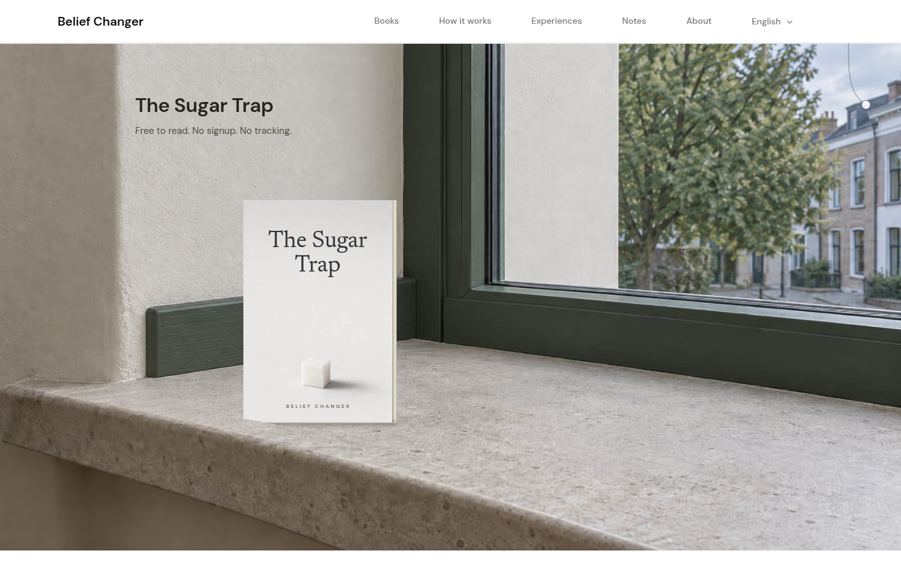
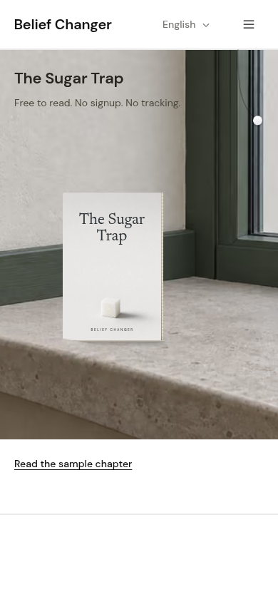
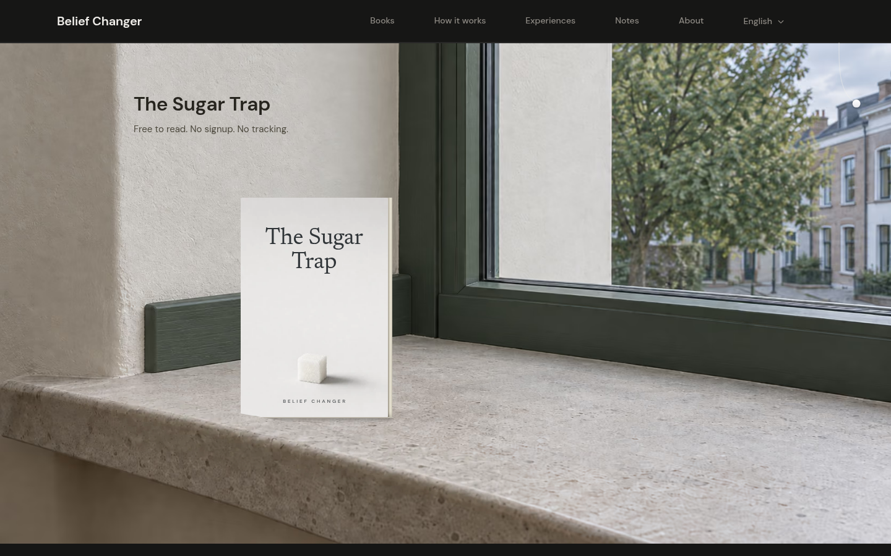
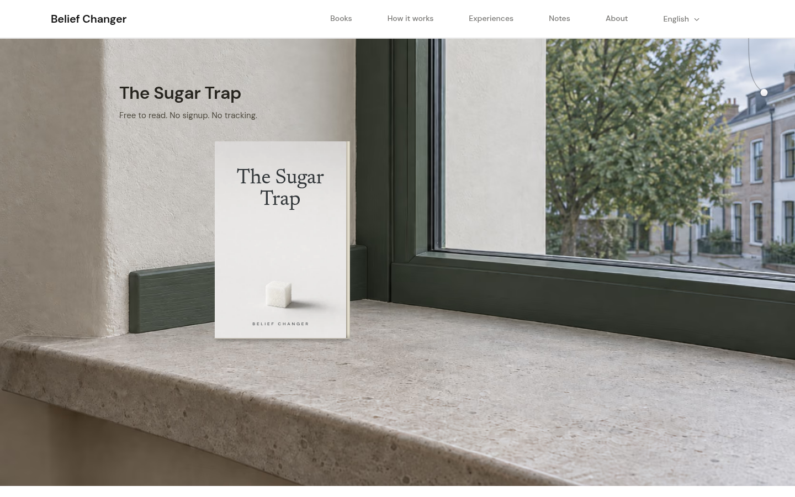

## Gallery — Track B

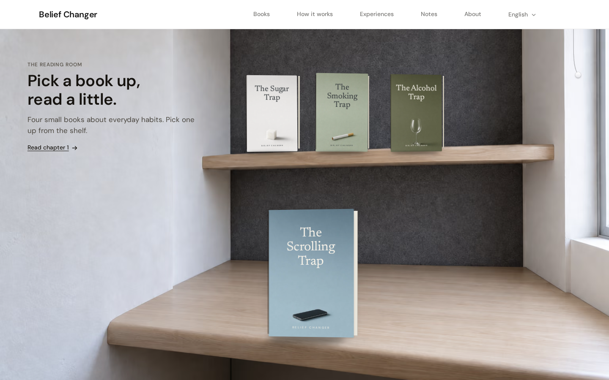
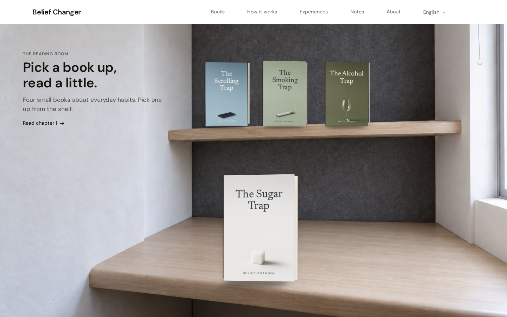
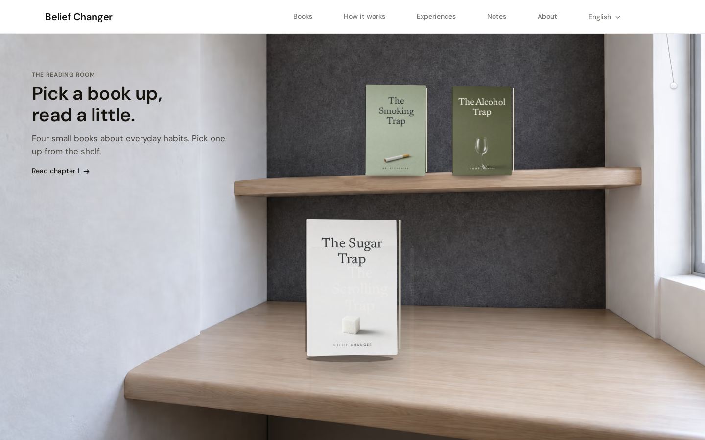
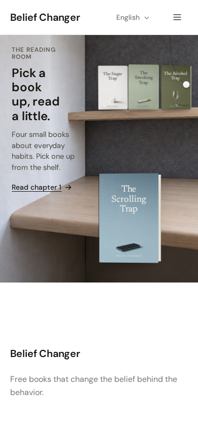
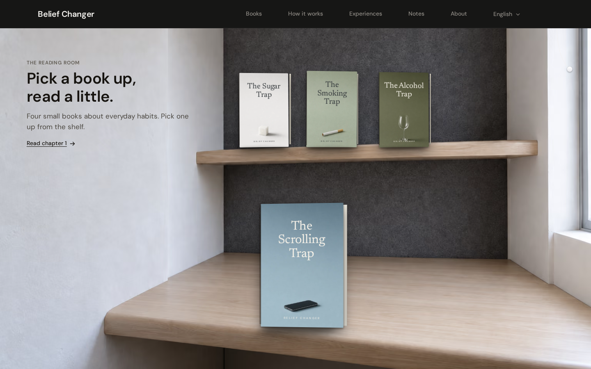

## Gallery — Track C

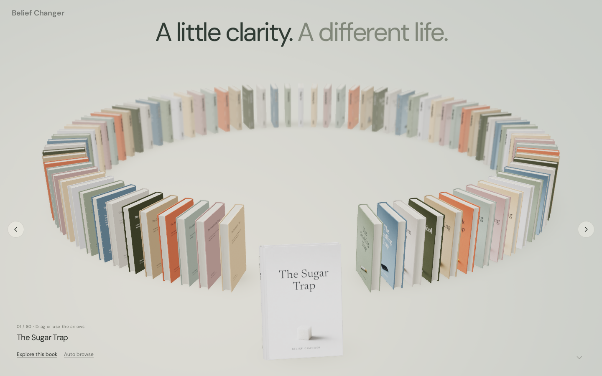
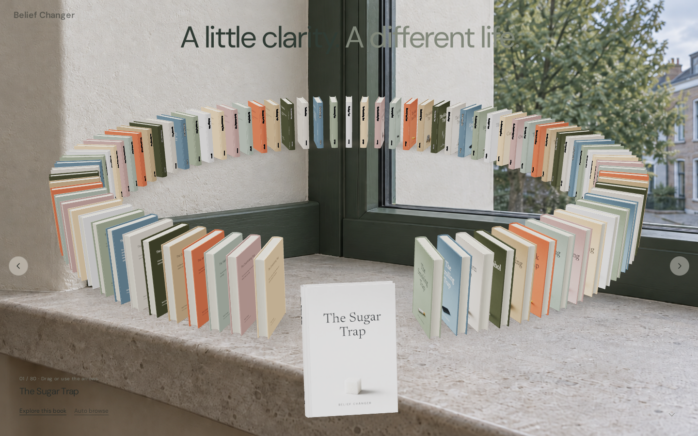
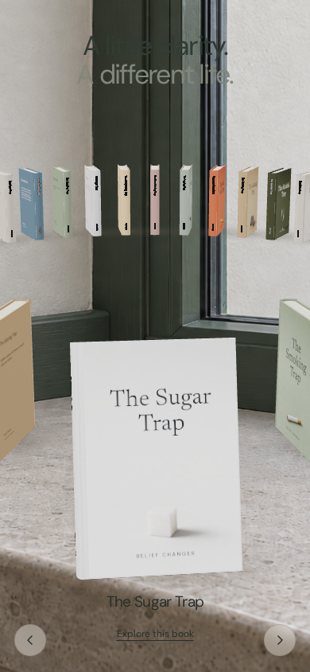
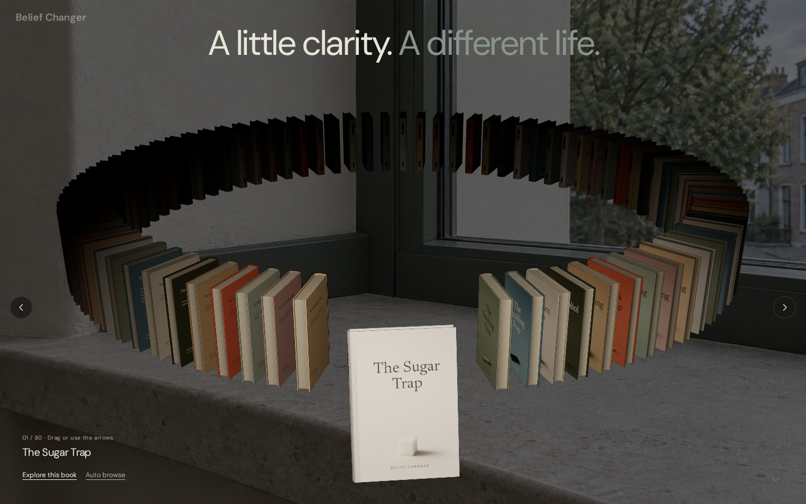
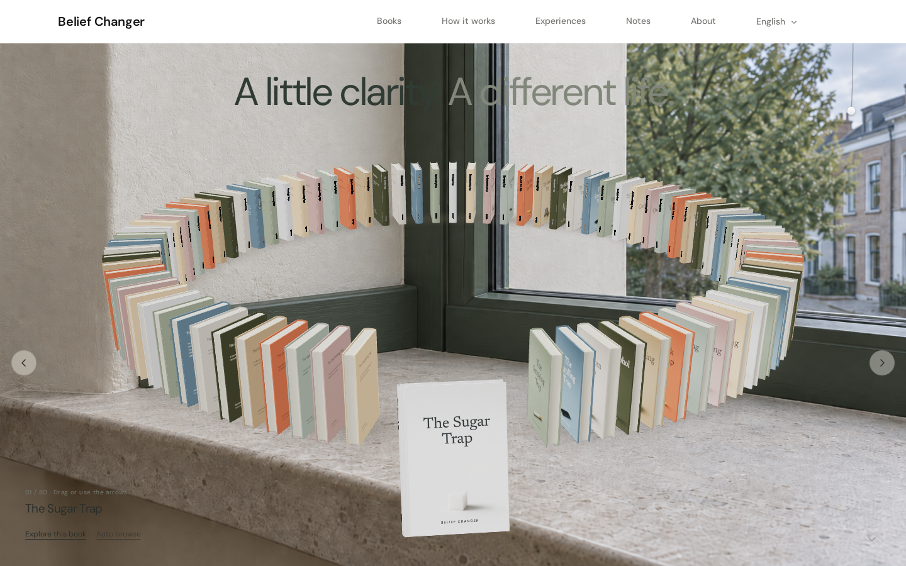
## Restart protocol

1. Fetch all remote branches and read this checkpoint first.
2. Open the branch-specific checkpoint README and latest result file before editing.
3. Review the preserved screenshots at ordinary desktop and phone size.
4. Keep accepted cover artwork pixel-true; image generation should author environments, lighting and spatial relationships around the covers, not repaint them.
5. Treat GPT Image work as an iterative design instrument: purpose → canvas → contents → relationships → appearance → checks, followed by visual QA and a small repair loop.
6. Use isolated worktrees for new revisions; do not overwrite the archived checkpoint states.
7. Preserve reduced-motion, dark, RTL/i18n, accessibility and performance evidence on every serious candidate.

### Track A next experiment

Re-author the receiving architecture around the exact fixed book/camera geometry. Generate/design the support surface, contact, foreground/background relationships and light direction specifically for the book. Do not spend another round on cheap CSS parallax.

### Track B next experiment

Re-author the room around one credible reader position. The chair/table/shelf/book relationship should make the selected book look naturally laid where a person would read it. Preserve the useful same-object transfer unless a better continuity mechanism is proven.

### Track C next experiment

Keep the existing Orbit and the R1 A/B/parity harness. Author a new environment around the actual Orbit ellipse, add a receiving/shadow-catching plane, match the live Three.js lighting to the generated scene, and create separate mobile and dark/night compositions. Kill any version that again reads as books floating over wallpaper.

## Validation status at pause

- Track A R13: 54/54 unit tests, clean typecheck/build per preserved result report.
- Track B R13: 73/73 unit tests, clean typecheck/build per preserved result report.
- Track C R1: 9/9 unit tests, clean typecheck/build, 13/13 relevant e2e checks per preserved result report.

These are checkpoint claims from the preserved result artifacts; rerun the relevant suite before promoting any future revision.
## Preserved research and reasoning

The external visual/X research package is committed under `research/`. Durable A/B ChatGPT Web reviewer conversation IDs and the continuation rule for Track C are recorded in `REASONING-THREADS.md`. This removes the dependency on the machine's temporary `/tmp` research directory.