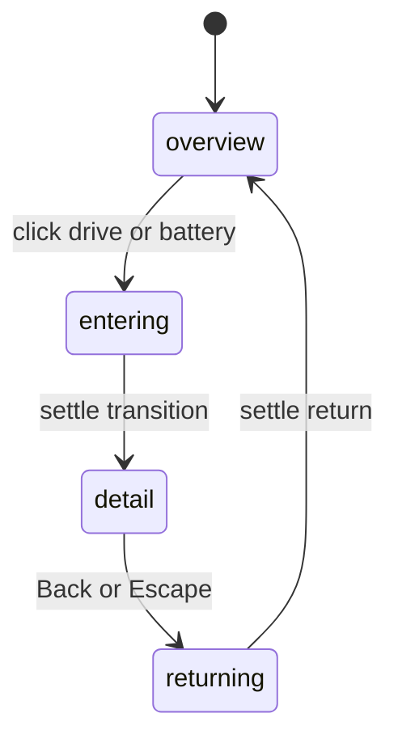

# How the scene works

The browser displays a pre-rendered vehicle, then coordinates short video and image states around it. A small amount of JavaScript gives the scene continuity. The site's visual richness comes from authored media rather than a runtime 3D renderer.

## File map

| File | Responsibility |
| --- | --- |
| `src/App.tsx` | Scene phases, selection, appearance locks, loading, Escape, shared geometry, presentation |
| `src/HoverVideo.tsx` | Four off-DOM video elements, canvas drawing, endpoint queue and detail handoff |
| `src/AppearanceMenu.tsx` | Paint/wheel menu presentation and option callbacks |
| `src/appearance.ts` | Five paints, three wheels, base exterior and exclusive-mode guard |
| `src/content.ts` | System copy, annotation coordinates, hotspot map and reserved clip metadata |
| `src/index.css` | Tokens, frame, layout, responsive menus, transitions and accessibility styles |
| `public/media/` | Real runtime media, no download step required |
| `scripts/ltx-generate.mjs` | Optional terminal-only generation workflow; absent from the browser bundle |

## Scene phases

`lock`, `ready`, `phase` and active appearance mode guard transitions. Clicking repeatedly does not start parallel transitions. A normal transition reveals the destination after 350ms and settles at 1250ms. Reduced motion makes these timers immediate and removes the CSS zoom.

The detail view is a still image with a CSS transition, not a generated camera flight. `content.ts` retains disabled `clips` declarations for a future production pass. Those URLs do not correspond to shipped files and are not used by the current player. The `optics` content/image is also retained as a dormant study; it is not a fifth active hotspot.

## Hover continuity

The player creates forward/reverse HTMLVideoElements for the hood and battery. It draws decoded frames into one opaque canvas. It does not expose a video's undecoded initial frame and does not replace the canvas at direction changes.

The desired hotspot and the settled pose are distinct. If the pointer leaves midway through opening the hood, the player finishes that short clip, then plays the hood's authored reverse. If the pointer moves to the battery meanwhile, the latest desired state wins after the neutral endpoint. The reverse films have independent time-remap curves, so proportional seeking would not preserve pose.

At detail entry, the current hover frame freezes. It stays visible beneath the destination crossfade, then resets only when detail is fully opaque. On playback failure, the last decoded canvas is retained and the neutral callback is released; no automatic generation or media replacement occurs. A 15-second watchdog bounds a stalled clip.

## Appearance contract

Opening Paint or Wheels clears the desired hover. The player completes its return to the neutral car; only then can a decoded appearance image be selected. Controls show waiting/loading states meanwhile.

Exactly one appearance mode is active. Other hotspots are disabled while it is open or closing. Selecting an option pins the panel. A hover-only panel can close on leaving its event owner; a bounded CSS corridor connects the hotspot and the displaced menu. The event owner itself is pointer-transparent outside those hit areas.

Closing uses the existing 260ms fade lock, resets to the base exterior and enables other points. The selected paint and wheels do not combine: these are independent render alternatives. The original focus-restoration race is documented in VERIFICATION.md.

## Shared image coordinates

Media and hotspots live in one `image-plane`. Coordinates are percentages of that plane, not the viewport. Its nominal ratio is 1672/941. A ResizeObserver recalculates its dimensions; the same CSS variables align header, title, media and footer.

At desktop widths the frame fits the available height, accounting for masthead, title and 164px footer. At 900px and below it uses viewport width minus 40px and a stacked composition. On short desktop screens (height at most 780px), technical copy moves below the frame without moving the media itself.

All media states pass through one `media-envelope`: a 3px white outer shadow and rounded clipping. The border adds no layout width. There are no per-state feather masks, recolouring overlays or duplicate blurred car images.

## Extension points

- For copy changes, edit visible JSX and `content.ts`; retain technical IDs.
- For options, change `appearanceOptions` with matching, aligned images. Additions need corresponding UI and behaviour checks.
- For a new vehicle, replace an entire aligned media set and remeasure anchors. Replacing only the exterior will break continuity.
- For player changes, work separately from visual restyling and test rapid inputs, decoding, failure, return and reduced motion.
- For new detail films, implement an explicit state contract first. Enabling dormant metadata alone will not create a camera-flight player.
